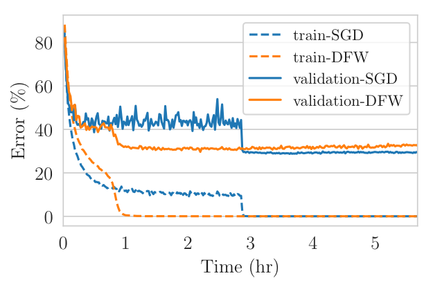

# Deep Frank-Wolfe For Neural Network Optimization

This repository contains the implementation of the paper [Deep Frank-Wolfe For Neural Network Optimization](https://arxiv.org/abs/1811.07591) in pytorch. If you use this work for your research, please cite the paper:

```
@Article{berrada2019deep,
  author       = {Berrada, Leonard and Zisserman, Andrew and Kumar, M Pawan},
  title        = {Deep Frank-Wolfe For Neural Network Optimization},
  journal      = {International Conference on Learning Representations},
  year         = {2019},
}
```

## Requirements

This code should work for pytorch >= 1.0 in python3. Detailed requirements are available in `requirements.txt`.

## Installation

* Clone this repository: `git clone --recursive https://github.com/oval-group/dfw` (note that the option `recursive` is necessary to have clone the submodules, these are needed to reproduce the experiments but not for the DFW implementation itself).
* Go to directory and install the requirements: `cd dfw && pip install -r requirements.txt`
* Install the DFW package `python setup.py install`

## Example of Usage

* Simple usage example:
```python
from dfw import DFW
from dfw.losses import MultiClassHingeLoss


# boilerplate code:
# `model` is a nn.Module
# `x` is an input sample, `y` is a label

# create loss function
svm = MultiClassHingeLoss()

# create DFW optimizer with learning rate of 0.1
optimizer = DFW(model.parameters(), eta=0.1)

# DFW can be used with standard pytorch syntax
optimizer.zero_grad()
loss = svm(model(x), y)
loss.backward()
# NB: DFW needs to have access to the current loss value,
# (this syntax is compatible with standard pytorch optimizers too)
optimizer.step(lambda: float(loss))
```

* Technical requirement: the DFW uses a custom step-size at each step. For this update to make sense, the loss function must be piecewise linear convex.
For instance, one can use a multi-class SVM loss or an l1 regression.

* Smoothing: sometimes the multi-class SVM loss does not fare well with a large number of classes.
This issue can be alleviated by using dual smoothing, which is easy to plug in the code:
```python
from dfw.losses import set_smoothing_enabled
...
with set_smoothing_enabled(True):
    loss = svm(model(x), y)
```

## Reproducing the Results



* To reproduce the CIFAR experiments: `VISION_DATA=[path/to/your/cifar/data] python reproduce/cifar.py`
* To reproduce the SNLI experiments: follow the [preparation instructions](https://github.com/lberrada/InferSent/tree/dfw#download-datasets) and run  `python reproduce/snli.py`

DFW largely outperforms all baselines that do not use a manual schedule for the learning rate.
The tables below show the performance on the CIFAR data sets when using data augmentation (AMSGrad, a variant of Adam, is the strongest baseline in our experiments), and on the SNLI data set.

### CIFAR-10:

<table>
<tr><th>Wide Residual Networks </th><th>Densely Connected Networks</th></tr>
<tr><td>

| Optimizer | Test Accuracy (%) |
| --------- | :--------------:  |
| AMSGrad   | 90.1             |
| **DFW**   | **94.7**         |
| SGD (with schedule)      | 95.4             |

</td><td>

| Optimizer | Test Accuracy (%) |
| --------- | :--------------:  |
| AMSGrad   | 91.8             |
| **DFW**   | **94.9**         |
| SGD (with schedule)       | 95.3             |

</td></tr> </table>

### CIFAR-100:

<table>
<tr><th>Wide Residual Networks </th><th>Densely Connected Networks</th></tr>
<tr><td>

| Optimizer | Test Accuracy (%) |
| --------- | :--------------:  |
| AMSGrad   | 67.8             |
| **DFW**   | **74.7**         |
| SGD (with schedule)       | 77.8             |

</td><td>

| Optimizer | Test Accuracy (%) |
| --------- | :--------------:  |
| AMSGrad   | 69.6             |
| **DFW**   | **73.2**         |
| SGD (with schedule)       | 76.3             |

</td></tr> </table>

### SNLI:

<table>

| Optimizer | Test Accuracy (%) |
| --------- | :--------------:  |
| Adagrad   | 84.6              |
| Adam      | 85.0              |
| AMSGrad   | 85.1              |
| BPGrad    | 84.2              |
| **DFW**   | **85.2**          |
| SGD (with schedule)   | 85.2          |

</table>

## Acknowledgments

We use the following third-part implementations:
* [InferSent](https://github.com/facebookresearch/InferSent).
* [DenseNets](https://github.com/andreasveit/densenet-pytorch).
* [Wide ResNets](https://github.com/xternalz/WideResNet-pytorch).
